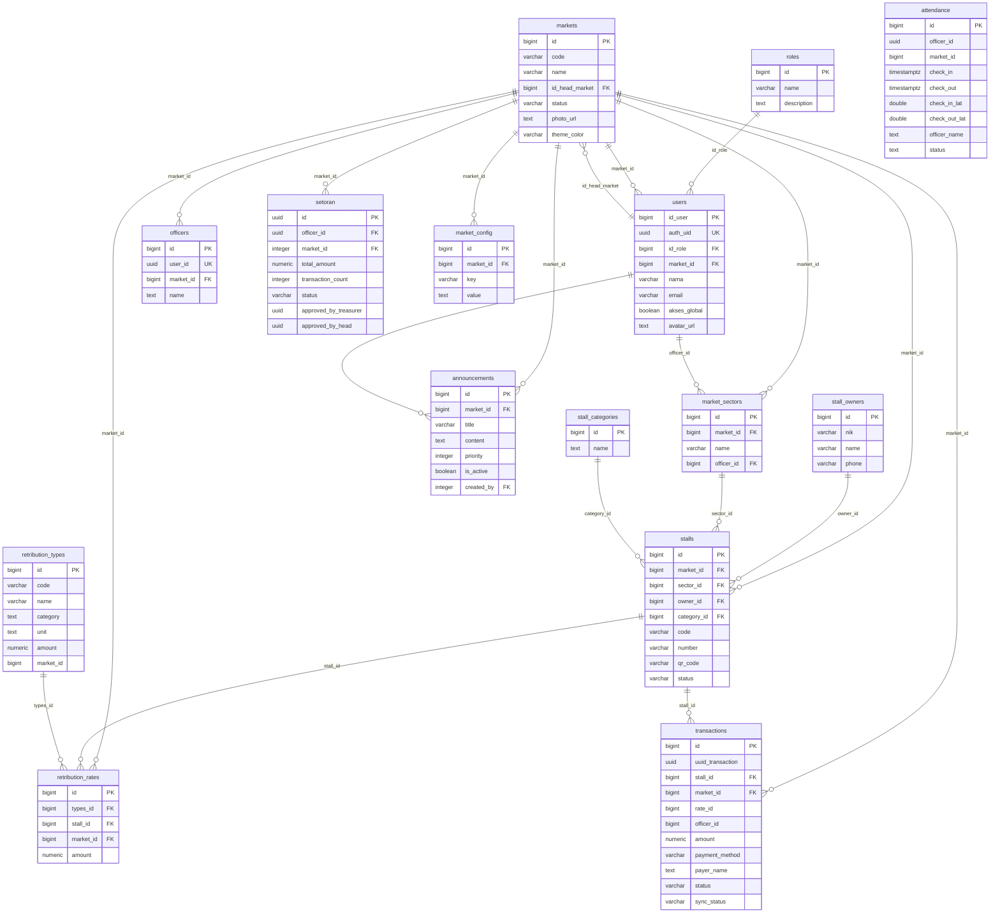

# 🗄️ Dokumentasi Skema Database — SIAGA

> **Item audit 3.14** · Diekstrak langsung dari production Supabase (23 Agu 2026)
> PostgreSQL 17.6 · 15 tabel · 35 RLS policy · 5 trigger · 18 FK constraint

---

## 📊 ERD (Entity Relationship Diagram)

---

## 📋 Deskripsi Tabel

### 1. `roles` — Master role pengguna
| Kolom | Tipe | Keterangan |
|-------|------|------------|
| id | bigint PK | ID role |
| name | varchar | Nama role (`ADMIN`, `MARKET_HEAD`, `TREASURER`, dll) |
| description | text | Deskripsi |

**Data:** 5 role

### 2. `users` — Pengguna sistem (admin, kepala pasar, bendahara)
| Kolom | Tipe | Keterangan |
|-------|------|------------|
| id_user | bigint PK | ID user |
| auth_uid | uuid UK | Link ke `auth.users` (Supabase Auth) |
| id_role | bigint FK → roles.id | Role user |
| market_id | bigint FK → markets.id | Pasar tempat bertugas |
| nama / username / email / no_hp | | Data profil |
| akses_global | boolean | Akses lintas pasar |
| status | varchar | Status akun |
| avatar_url | text | Foto profil |

**Data:** 3 user

### 3. `markets` — Master pasar
| Kolom | Tipe | Keterangan |
|-------|------|------------|
| id | bigint PK | ID pasar |
| code / name / address / city | | Identitas pasar |
| timezone | varchar | Zona waktu |
| status | varchar | Status operasional |
| id_head_market | bigint FK → users.id_user | Kepala pasar |
| photo_url / head_photo_url / logo_url | text | Foto |
| theme_color | varchar | Warna tema landing page |

**Data:** 21 pasar

### 4. `officers` — Petugas lapangan
| Kolom | Tipe | Keterangan |
|-------|------|------------|
| id | bigint PK | |
| user_id | uuid UK → auth.users | Akun petugas |
| market_id | bigint FK → markets.id | Pasar penugasan |
| name | text | Nama |

**Data:** 4 petugas

### 5. `market_sectors` — Sektor/blok dalam pasar
| Kolom | Tipe | Keterangan |
|-------|------|------------|
| id | bigint PK | |
| market_id | bigint FK → markets.id | |
| name | varchar | Nama sektor (mis. "Blok A") |
| officer_id | bigint FK → users.id_user | Petugas penanggung jawab sektor |

**Data:** 4 sektor

### 6. `stall_categories` — Kategori lapak
| Kolom | Tipe |
|-------|------|
| id | bigint PK |
| name | text |
| description | text |

### 7. `stall_owners` — Pemilik lapak
| Kolom | Tipe |
|-------|------|
| id | bigint PK |
| nik | varchar |
| name / address / phone | |

### 8. `stalls` — Lapak
| Kolom | Tipe | Keterangan |
|-------|------|------------|
| id | bigint PK | |
| market_id | bigint FK → markets.id | |
| sector_id | bigint FK → market_sectors.id | Blok/sektor |
| owner_id | bigint FK → stall_owners.id | Pemilik |
| category_id | bigint FK → stall_categories.id | Kategori |
| code / number / qr_code | varchar | Identitas & QR |
| status | varchar | Status lapak |

**Data:** 87 lapak

### 9. `retribution_types` — Jenis retribusi
| Kolom | Tipe | Keterangan |
|-------|------|------------|
| id | bigint PK | |
| code / name / description | | Identitas jenis |
| category / unit / notes | text | Kategori & satuan |
| amount | numeric | Tarif default |
| market_id | bigint | NULL = global semua pasar |

### 10. `retribution_rates` — Tarif per lapak/jenis
| Kolom | Tipe | Keterangan |
|-------|------|------------|
| id | bigint PK | |
| types_id | bigint FK → retribution_types.id | |
| stall_id | bigint FK → stalls.id | NULL = berlaku level pasar |
| market_id | bigint FK → markets.id | |
| amount | numeric | Tarif |

**Constraint:** UNIQUE (stall_id, types_id) — mencegah duplikat

### 11. `transactions` — Transaksi pembayaran retribusi ⭐ tabel inti
| Kolom | Tipe | Keterangan |
|-------|------|------------|
| id | bigint PK | |
| uuid_transaction | uuid | UUID untuk sync offline |
| stall_id | bigint FK → stalls.id | Lapak |
| market_id | bigint FK → markets.id | Pasar (validasi via trigger) |
| rate_id | bigint | Referensi tarif |
| officer_id | bigint | Petugas pencatat |
| amount | numeric | Jumlah bayar (**kolom final**, total_amount dihapus) |
| payment_method | varchar | QRIS / Tunai |
| payer_name | text | Nama pembayar |
| status | text | paid / pending |
| source / sync_status | varchar | Offline sync tracking |

**Data:** 15 transaksi

### 12. `attendance` — Absensi petugas
| Kolom | Tipe | Keterangan |
|-------|------|------------|
| id | bigint PK | |
| officer_id | uuid | Petugas |
| market_id | bigint | Pasar |
| check_in / check_out | timestamptz | Jam masuk/keluar |
| check_in_lat/lng, check_out_lat/lng | double | GPS lokasi |
| officer_name | text | Snapshot nama |
| status | text | hadir/izin/dll |

### 13. `setoran` — Setoran ke bendahara/kepala pasar
| Kolom | Tipe | Keterangan |
|-------|------|------------|
| id | uuid PK | |
| officer_id | uuid FK → auth.users | Petugas penyetor |
| market_id | integer FK → markets.id | |
| total_amount | numeric | Total uang disetor |
| transaction_count | integer | Jumlah transaksi |
| proof_image_url | text | Bukti foto |
| status | text | pending_treasurer → pending_head → approved / rejected |
| approved_by_treasurer / approved_by_head | uuid | Approver |

### 14. `market_config` — Konfigurasi dinamis per pasar
| Kolom | Tipe | Keterangan |
|-------|------|------------|
| id | bigint PK | |
| market_id | bigint FK → markets.id | |
| key | varchar | Mis. `daily_target_stalls` |
| value | text | Nilai bebas |

**Constraint:** UNIQUE (market_id, key)

### 15. `announcements` — Pengumuman
| Kolom | Tipe | Keterangan |
|-------|------|------------|
| id | bigint PK | |
| market_id | bigint FK → markets.id | NULL = global semua pasar |
| title / content | | Isi pengumuman |
| priority | integer | Urutan prioritas |
| is_active | boolean | Aktif/tidak |
| start_date / end_date | timestamptz | Periode tayang |
| created_by | integer FK → users.id_user | Pembuat |

---

## 🔐 RLS Policy Map (35 policy)

| Tabel | Policy | Operasi | Aturan |
|-------|--------|---------|--------|
| officers | officers_select_own | SELECT | user_id = auth.uid() |
| officers | officers_insert_own | INSERT | WITH CHECK user_id = auth.uid() |
| officers | officers_update_own | UPDATE | user_id = auth.uid() |
| officers | officers_select_auth | SELECT | authenticated = true |
| attendance | attendance_officer_select | SELECT | officer_id = auth.uid() |
| attendance | attendance_officer_insert | INSERT | officer_id = auth.uid() |
| attendance | attendance_officer_update | UPDATE | officer_id = auth.uid() |
| attendance | attendance_select | SELECT | authenticated = true |
| setoran | setoran_officer_select | SELECT | officer sendiri ATAU TREASURER/MARKET_HEAD/ADMIN |
| setoran | setoran_officer_insert | INSERT | officer sendiri |
| setoran | setoran_approval_update | UPDATE | TREASURER/MARKET_HEAD/ADMIN |
| market_config | read | SELECT | authenticated |
| market_config | update | UPDATE | ADMIN/MARKET_HEAD/TREASURER di market-nya |
| announcements | read | SELECT | authenticated |
| announcements | manage | ALL | ADMIN/MARKET_HEAD/TREASURER di market-nya, atau global |
| transactions | authenticated_can_insert_transactions | INSERT | authenticated (validasi detail via trigger) |
| transactions | transactions_select_own | SELECT | scoped per market |
| transactions | transactions_update_own | UPDATE | scoped per market |
| *(+17 policy lain)* | | | |

## ⚡ Trigger & Function

| Trigger | Tabel | Fungsi |
|---------|-------|--------|
| trg_validate_transaction_market | transactions | Validasi: petugas hanya insert transaksi market-nya; admin bebas |
| update_officers_timestamp | officers | Auto-update updated_at |
| update_attendance_timestamp | attendance | Auto-update updated_at |
| update_setoran_timestamp | setoran | Auto-update updated_at |
| update_retribution_rates_timestamp | retribution_rates | Auto-update updated_at |

| Function | Keterangan |
|----------|-----------|
| get_current_user_market_id() | Market user login (SECURITY DEFINER) |
| is_current_user_admin() | Cek role admin (SECURITY DEFINER) |
| validate_transaction_market() | Trigger function validasi transaksi |
| get_today_revenue_for_setoran(uuid) | Total revenue hari ini untuk setoran |

---

## ⚠️ Catatan Konsistensi Skema

1. **Tipe ID campuran**: sebagian besar `bigint`, tapi `setoran.market_id` = `integer`, `setoran.officer_id` = `uuid` (ke auth.users), `attendance.officer_id` = `uuid`. Ini inkonsisten tapi berfungsi.
2. **`users.id_user`** (bukan `id`) — PK custom; semua FK harus merujuk `id_user`.
3. **Nama tabel sektor**: `market_sectors` (bukan `sectors`).
4. **Kolom `amount`** di transactions adalah final (`total_amount` sudah dihapus).
5. **`retribution_rates`**: UNIQUE(stall_id, types_id) mencegah duplikat.